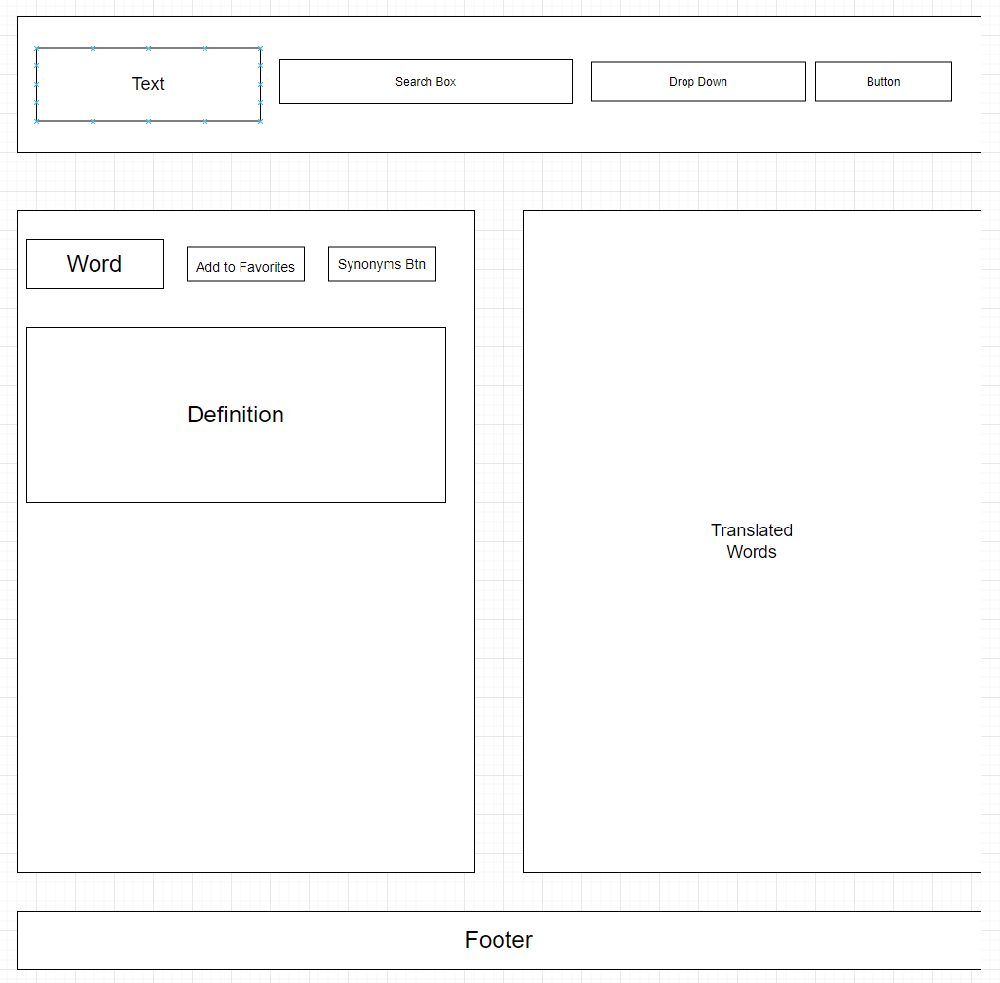

# Translator-Group_2

This translation app will accept a word and give the definition and a translation into another selected language. The user will also be able to save favorite words to local storage. 

As a world traveler.
I want to translate words to another language.
So I can better communicate.

Sketch:

APIs:
https://www.deepl.com/
https://www.wordsapi.com/

Tasks:
clone the repo
create a branch
create files
connect APIs

