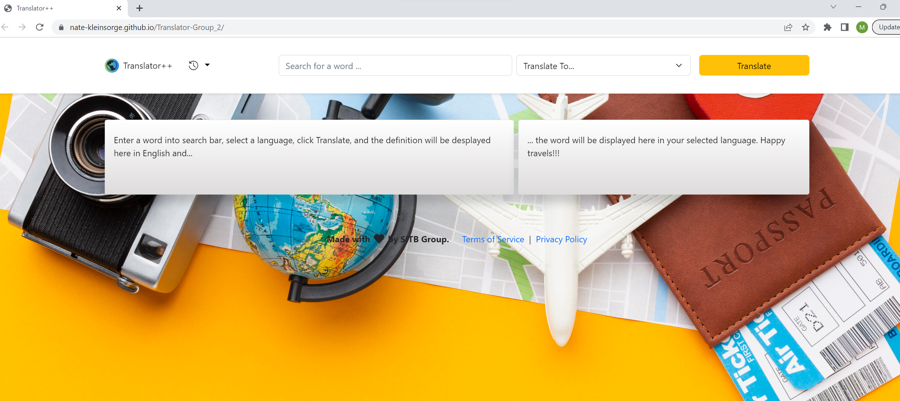

# Translator-Group_2

This translation app accepts a word and gives the definition and a translation into another selected language. 

As a world traveler.
I want to translate words to another language.
So I can better communicate.

APIs:

https://wordsapiv1.p.rapidapi.com

https://microsoft-translator-text.p.rapidapi.com

Deployed app: 

https://nate-kleinsorge.github.io/Translator-Group_2/

